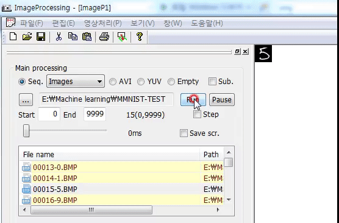

# Image-Processing
Image-Processing (Windows)

## Introduction
* Open source program for Image processing and Computer Vision
* Visual Studio 2019, 2017, 2015, 2013 and lower

## Source codes
* Bitmap load and save (cpp), jpeg load and save (lib)
* Format conversion (RGB, YUV)
* Low level image processing (spatial filtering, frequency transform, ...)
* Geometric transformation (affine, bilinear, perspective, ...)
* Simple operations (Hough, boundary following, labeling, thinning, morphological operations, ...)
* **Sequential processing**
  + Image sequences (bmp, jpeg, pcx, ppm, png, raw)
  + Avi sequences
  + YUV sequences
* **Multi-layer perceptron (MLP)**
<br><br> </img>  

## Example code for sequential processing
1. Add a new class
2. Add a new processing method (1D array image)
3. Add an instance member to CMainProcessDlg class (MainProcessDlg.h)
4. Call the processing method as follows: 
``` C++
void CMainProcessDlg::OnTimer(UINT_PTR nIDEvent) 
{
    ...
      else if(nIDEvent == TID_SEQUENCE_RUN)
			{
				Sleep(m_nSleep);
				...
				else if(FileName.Right(4) == _T(".JPG"))
				{
					Image1D = ReadJpeg(mbcsFileName, &nW, &nH);
				}

				if(Image1D)
				{
					// Processing
					DisplayCimage1D(Image1D, nW, nH, 0, 0, false, true);
					// Instance.NewMethodExample(Image1D, nW, nH); // call 
					//
					m_bFirstFrame = false;
					delete [] Image1D;
				}
			
				CString DispFrameNum;
				DispFrameNum.Format(_T("%d(0,%d)"), m_nCurrentProcessingNum, m_nSequenceLength-1);
				SetDlgItemText(IDC_TOTAL_FRAME, DispFrameNum);

				m_nCurrentProcessingNum++;
			}
  ...
}
```
