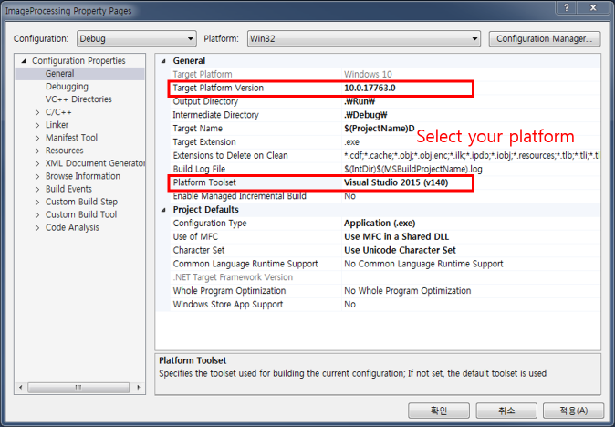

# Image-Processing
* Image Processing (Windows)
* C/C++ development tool for image processing, computer vision and machine learning

## Introduction
* Open program sources (without OpenCV)
* Visual Studio 2019, 2017, 2015, 2013 and lower 
* GUI: MFC
* Win32 and x64

## Source codes
* Bitmap load and save (cpp), jpeg load and save (lib)
* Format conversion (RGB, YUV420, YUV422, YUV444)
* Low level image processing (spatial filtering (including fast versions), frequency transform (DFT, FFT, DCT), ...)
* Geometric transformation (affine, bilinear, perspective, ...)
* Simple operations (Hough, boundary following, labeling, thinning, morphological operations, ...)
* Drawing functions for text (Windows), line, circle and ellipse
* ROI setting (AABB and polygons)
* Web camera processing
* Image sequence saving
* Easy debugging (image, text, listbox)
* **Sequential processing**
  + Image sequences (bmp, jpeg, pcx, ppm, png, raw)
  + Avi sequences
  + YUV sequences
<br><br> </img>  
* **Multi-layer perceptron (MLP)**
* **Avi recording**
  + Examples: [pupil segmentqtion](https://sites.google.com/site/khuaris/home/pupil-segmentation), [video stitching](https://sites.google.com/site/khuaris/home/video-stitching)

## Example code for sequential processing
1. Add a new class
2. Add a new processing method (1D array image - BGR, 24bit, 4byte aligned) 
3. Add an instance member to CMainProcessDlg class (MainProcessDlg.h)
4. Call the processing method as follows: 
``` C++
void CMainProcessDlg::OnTimer(UINT_PTR nIDEvent) {
    ...
			else if(nIDEvent == TID_SEQUENCE_RUN) {
				Sleep(m_nSleep);
				...
				else if(FileName.Right(4) == _T(".JPG")) {
					Image1D = ReadJpeg(mbcsFileName, &nW, &nH);
				}

				if(Image1D) {
					// Processing
					DisplayCimage1D(Image1D, nW, nH, 0, 0, false, true);
					// Instance.NewMethodExample(Image1D, nW, nH); // call 
					//
					m_bFirstFrame = false;
					delete [] Image1D;
				}
			
				CString DispFrameNum;
				DispFrameNum.Format(_T("%d(0,%d)"), m_nCurrentProcessingNum, m_nSequenceLength-1);
				SetDlgItemText(IDC_TOTAL_FRAME, DispFrameNum);

				m_nCurrentProcessingNum++;
			}
  ...
}
```

## Example code for connected-component labeling
``` C++
int **Label = imatrix(nH, nW);
int SmallThre = 20; 	// the minimum area threshold for eliminating small connected components

// Image: 	foregrounds	ImageGray[y][x] > 128, 
// 		backgrounds 	otherwise
int LabelCnt = Labeling(Image, Label, nW, nH, SmallThre); 	// returns the number of labels
								// Labels are started from 0
								// Background regions are labeled as -1

if(LabelCnt > 0)
{
	CIpRect *pBoundBox = new CIpRect[LabelCnt]; 		// Bounding box (AABB: axis aligned bounding box)
	SetLabelBoundBox(Label, nW, nH, pBoundBox, LabelCnt); 	// extracts bounding boxes
	
	// Bounding box processing
	
	delete [] pBoundBox;
}
		
free_imatrix(Label, nH, nW);
``` 

## Example code for displaying images
``` C++
unsigned char **ImageGray;	// 2D image array (grayscale)
unsigned char *Image1D; 	// 24bit color, BGR, 4byte alligned
unsigned char **ImageRed, **ImageGreen, **ImageBlue; // 2D image array (red, green and blue components)
int **IIimage2D;		// 2D image array (int)
double **DImage2D;		// 2D image array (double)

int nW, nH;		// Image size
int nPosX, nPosY; 	// Display position
int Scale = 100;	// Display scale

// bool DisplayCimage2D(unsigned char  **ImageGray, int nW, int nH, int nPosX, int nPosY, 
//	bool bErase = true, bool bDelete = false, int Rate = 100);
// if bErase is ture, the images which are not listed are erased
// if bDelete is ture, the previously displayed image having the same size and the same position with the current image 
//			is deleted from the dispaly list
DisplayCimage2D(ImageGray, nW, nH, nPosX, nPosY, false, ture, Scale);
DisplayIimage2D(IIimage2D, nW, nH, nPosX, nPosY, false, ture);	// IIimage2D data are normalized to [0, 255]
DisplayDimage2D(DImage2D, nW, nH, nPosX, nPosY, false, ture);	// DImage2D data are normalized to [0, 255]
DisplayCimage1D(Image1D, nW, nH, nPosX, nPosY, false, true, Scale);
DisplayCimage2DColor(ImageRed, ImageGreen, ImageBlue, nW, nH, nPosX, nPosY, false, true, Scale);
``` 

## Visual Studio
* Visual Studio 2019, 2017, 2015, 2013 and lower 
  + MFC libraries are required    	  
  + Project setting
<br> </img>  
* Visual Studio 2013 and lower 
  + Replace JpegLib.lib, JpegLibD.lib, JpegLib_64.lib and JpegLibD_64.lib with those in Libs(2013)
* If the MFC libraries were not installed
  1. Run 'Visual Studio Installer' by selecting the menu: [Tools]-[Get Tools and Features...]
  2. Check [Desktop development with C++] in Workloads tab 
  3. Check [MFC and ATL support(x86 and x64)] in Summary
  4. Click [Modify] button
